# KidBright Engine

### KidBright Chain Interface
สามารถเชื่อมต่อฮาร์ดแวร์ขยาย ได้ 3 แบบ
- I2C Chain
- SPI Chain
- I/O Chain

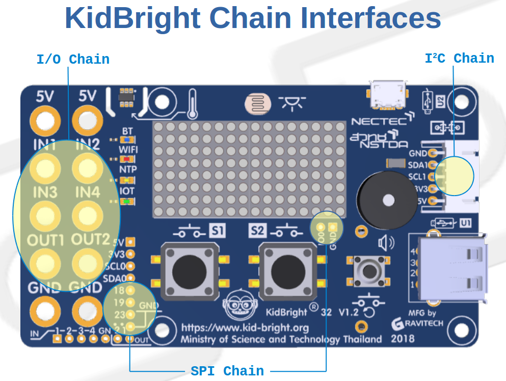

### Channel Expander
สำหรับ I2C และ SPI สามารถเพิ่มเติมฮาร์ดแวร์ที่ช่วยขยายจากที่มีอย่างละ 1 แชลแนล ได้สูงสุด 64 แชลแนล โดยจะได้ประโยชน์ดังนี้
- การใช้อุปกรณ์ที่มี address เดียวกันได้ (แยกต่ออยู่คนละแชลแนล)
- ขยายความสามารถในด้านการขับอุปกรณ์จำนวนมาก
- กรณีต้องการแปลงแรงดันไปใช้กับอุปกรณ์แบบ 5 โวลท์

[วงจร Channel Expander](https://gitlab.com/kidbright/kbide/blob/master/docs/schematics/kidbright_expansion_rev11.pdf)

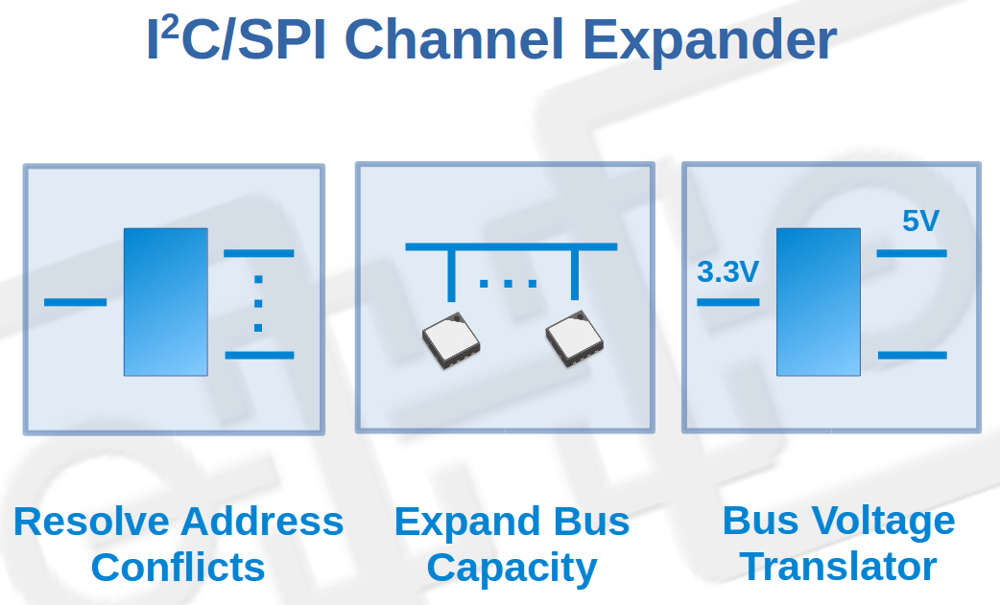

### I2C Channel Expander
การขยายช่องต่อ I2C ใช้ไอซี TCA9548A กรณีต้องการใช้อุปกรณ์ I2C ที่มี address เดียวกัน ให้ต่อบนแชนแนลอื่นๆ ยกเว้น แชลแนล 0
- ไอซี TCA9548A ตัวแรก ตั้งค่า address 0x70
- เพิ่ม TCA9548A ได้สูงสุด 8 ตัว (address 0x70 ถึง 0x77)

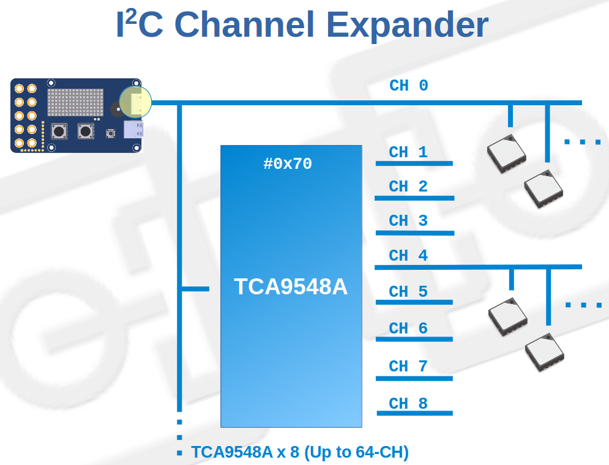

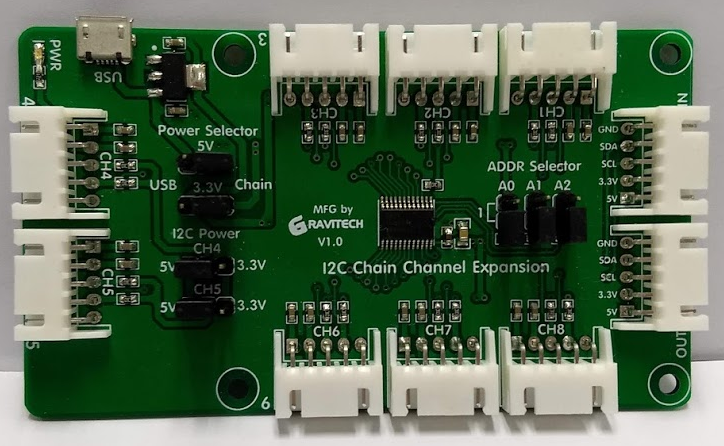

### SPI Channel Expander
การขยายช่องต่อ SPI ใช้ไอซี MCP23S17
- ไอซี MCP23S17 ตัวแรก ตั้งค่า address 0x24
- เพิ่ม MCP23S17 ได้สูงสุด 4 ตัว (address 0x24 ถึง 0x27)
- MCP23S17 address 0x20 ถึง 0x23 ถูกสำรองไว้ใช้สำหรับการทำฮาร์ดแวร์ขยาย GPIO

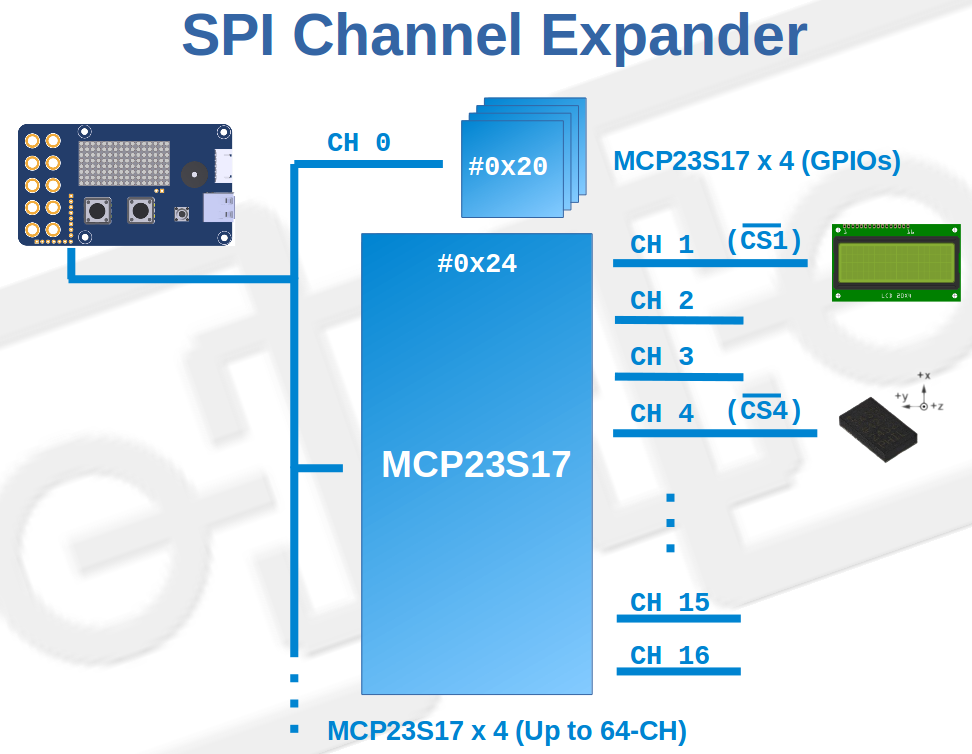

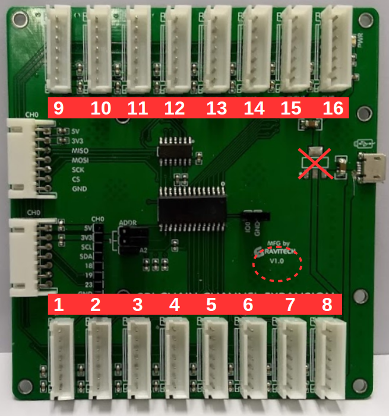

### Software Stack

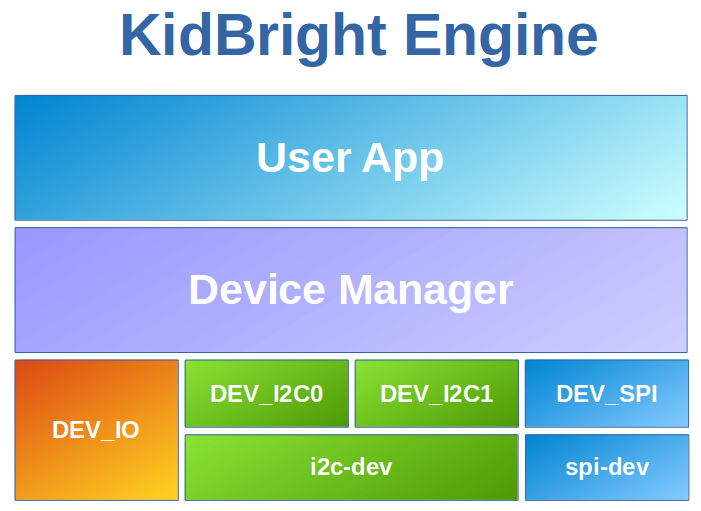

### I2C/SPI Device Driver
- i2c-dev และ spi-dev เป็นซอร์ฟแวร์ device driver สำหรับ I2C และ SPI ตามลำดับ
- มี Method รองรับ Detect (อุปกรณ์ I2C) และ Read/Write
- จัดการเรื่องการสลับแชลแนลขณะติดต่ออุปกรณ์
- กำหนดความเร็วของ SPI ได้

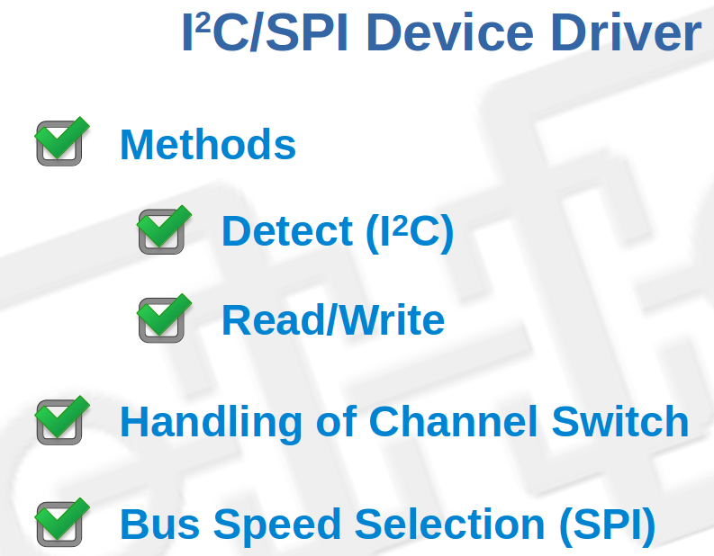

### Device Platform C++ Class
device class สำหรับพัฒนาอุปกรณ์ชนิดใหม่ๆ ออกแบบบนพื้นฐาน Non-Blocking I/O Model

Virtual Methods ที่ต้องเตรียมไว้
- Initialize สำหรับกำหนดค่าเริ่มต้นต่างๆ
- State Machine (process) สำหรับให้ถูกเรียกทำงานในแบบ Non-Blocking
- Properties สำหรับ CLI เป็นตัวเลือก สามารถเพิ่มเติมให้สมบูรณ์ภายหลังได้
- มีสถานะการทำงานของอุปกรณ์ และฟังก์ชั่นคำนวณเวลาที่ผ่านไปเพื่อนำไปคำนวณการทำงานตามเวลาได้

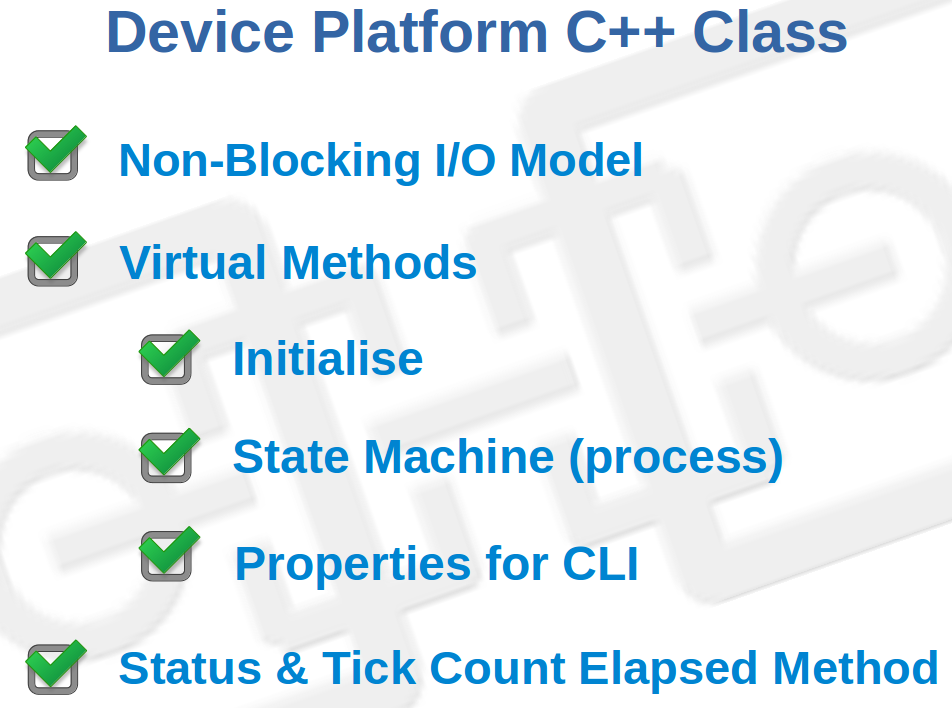

### Device Manager Engine
เป็นตัวบริหารจัดการอุปกรณ์ทุกๆตัวที่ถูกเลือกใช้งานในการเขียนโปรแกรมแบบบล๊อกจาก KidBright IDE
- ทำหน้าที่ลงทะเบียนอุปกรณ์ที่เลือกใช้งาน
- เข้าไปทำงานใน State Machine ของแต่ละอุปกรณ์
- จัดการการใช้ทรัพยากรที่ใช้ร่วมกันระหว่างหลายๆอุปกรณ์
- ให้บริการคำสั่ง CLI เพื่อสอบถามสถานะของอุปกรณ์

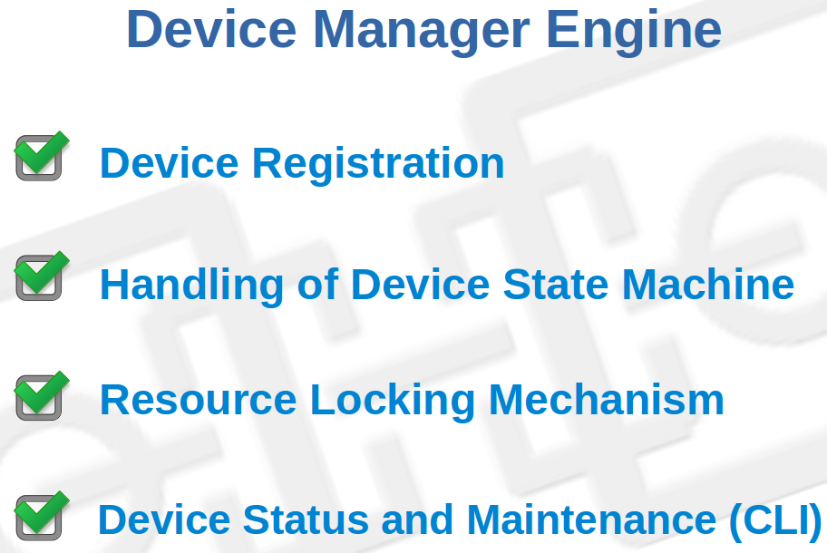

### Device Manager tasks
device manager จะสร้าง task จำนวน 4 tasks โดยแต่ละ task จะมี list เก็บรายการอุปกรณ์ (device) ที่อยู่ใน task ซึ่งเพิ่มเข้ามาจากขั้นตอนการลงทะเบียน เพื่อบริหารจัดการต่อไป ดังนี้
- DEV_IO task
- DEV_I2C0 task
- DEV_I2C1 task
- DEV_SPI task

โดย task priority ทั้งหมดที่อยู่ในระบบ device manager จะสูงกว่าของ user application ที่สร้างตอนเขียนโปรแกรมแบบบล๊อก

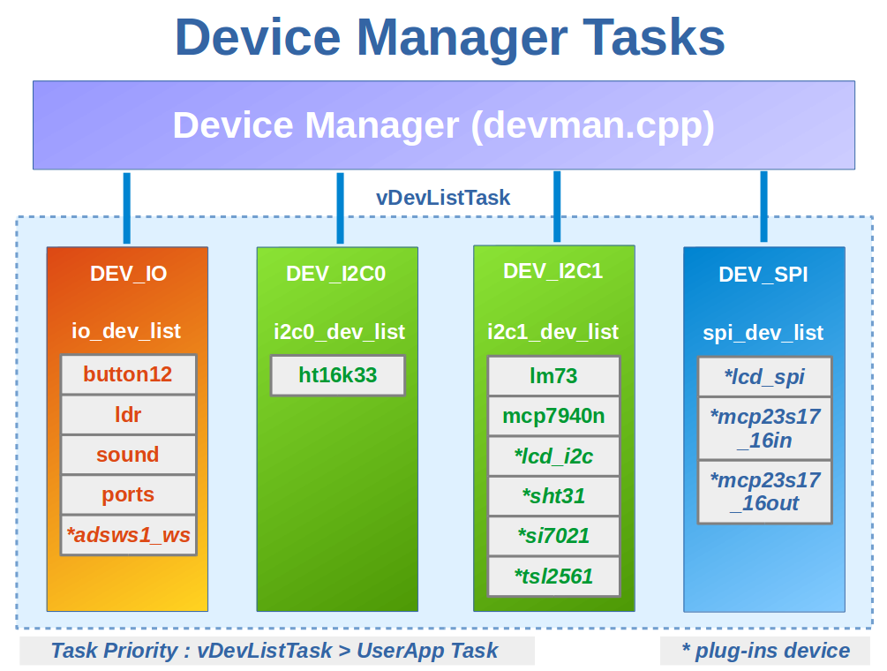

### vDevListTask State Machine
ขั้นตอนการทำงานของแต่ละ task ใน device manager มีดังนี้
- s_init เป็น state ที่ device manager เรียกเม็ด-ธ็อด init ของแต่ละ device ที่อยู่ใน list เพื่อให้แต่ละ device ทำการกำหนดค่าเริ่มต้นต่างๆ
- s_wait เป็น state device manager เรียกเม็ด-ธ็อด process ของแต่ละ device ที่อยู่ใน list แล้วรอจนกว่า initialized หรือ error flag เป็น true เพื่อรอให้ device อยู่ในสถานะพร้อมใช้งาน
- s_proc เป็น state device manager เรียกเม็ด-ธ็อด process ของแต่ละ device ที่อยู่ใน list เพื่อให้ device ทำงานอย่างต่อเนื่อง

state machine นี้ทำงานโดยมี idle ในแต่ละ state ตามค่า task_idle_ms ของ device list แต่ละชุดที่ device manager สร้างขึ้น

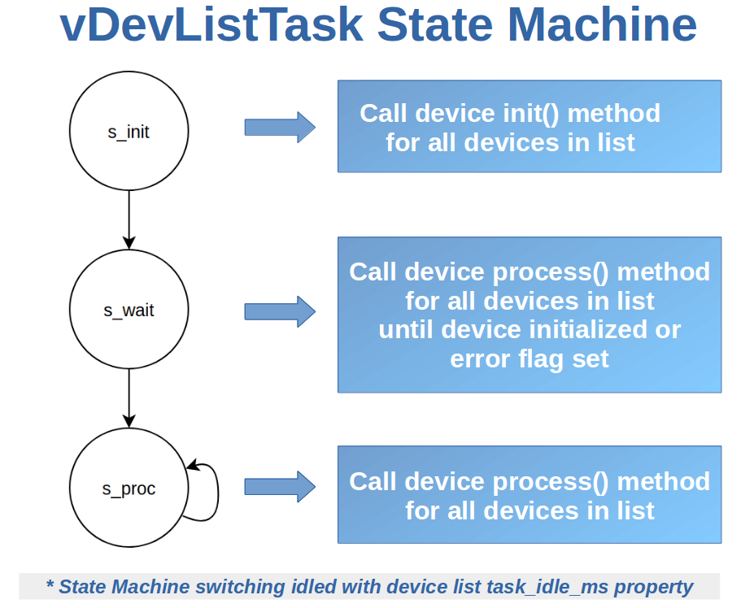
