# BLE UART plugin

### การสื่อสารผ่านบลูทูธแบบ BLE UART
- รับส่งข้อมูลผ่านการสื่อสารแบบบลูทูธ (Bluetooth)
- การรับข้อมูลเมื่อมีข้อมูลเข้ามา (Event Based)
- การส่งข้อมูลเป็นแบบตัวอักษรหรือตัวเลข

### สถานะการเชื่อมต่อบลูทูธใช้แอลอีดีสีฟ้า (BT) บนบอร์ด KidBright
- ไม่มีการเชื่อมต่อ แอลอีดีกระพริบ
- การเชื่อมต่อสำเร็จ แอลอีดีติดค้าง

### บล๊อก
- หมวด Bluetooth
- บล๊อก BLE UART On Data สำหรับกำหนดขอบเขตโปรแกรมที่เขียนเพื่อให้ทำงานเมื่อมีข้อมูลเข้ามา
- บล๊อก BLE UART Read Text สำหรับอ่านค่าข้อมูลที่รับได้
- บล๊อก BLE UART Send สำหรับส่งตัวอักษรหรือตัวเลข

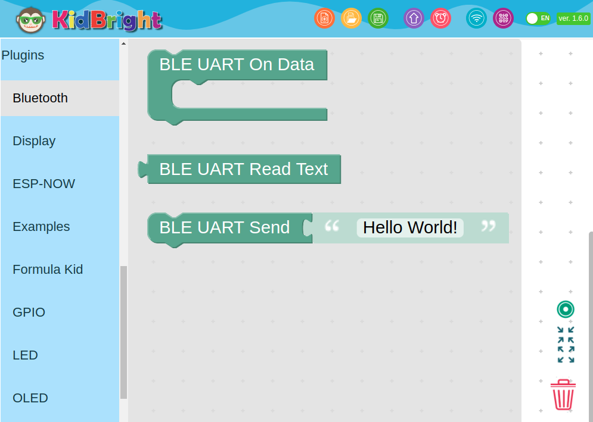

### การทดสอบ
- ทดสอบคู่กับแอพพลิเคชั่น nRF Toolbox บนสมาร์ทโฟน

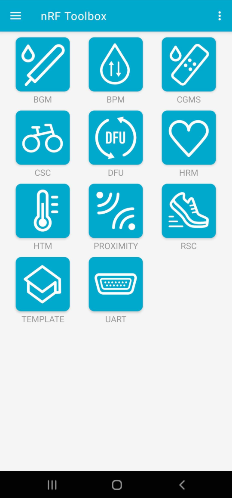

- กดปุ่มเลือก UART

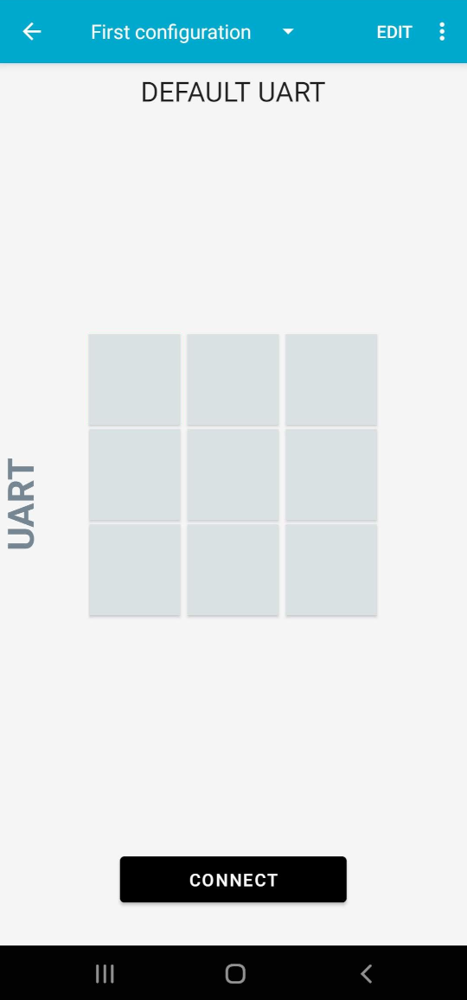

### เพิ่มปุ่มสำหรับส่งตัวอักษรบน nRF Toolbox ไปยังบอร์ด KidBright
- กดปุ่ม EDIT

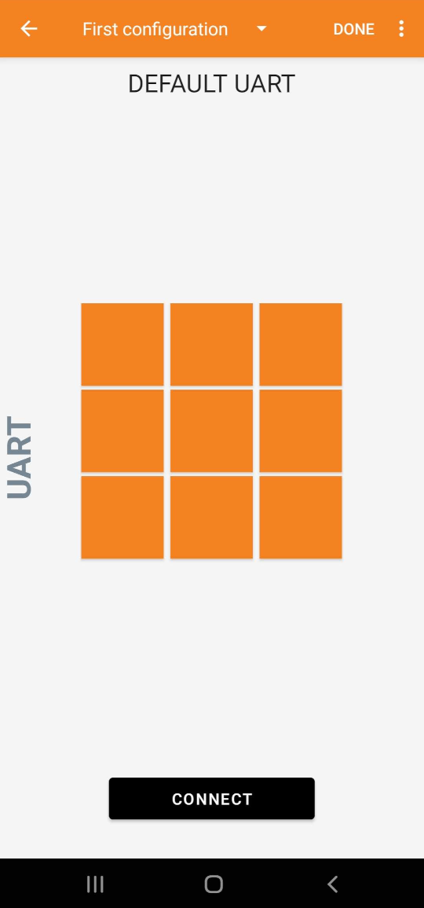

- เลือกกดปุ่มสีส้มเพื่อกำหนดตัวอักษรที่จะส่ง แล้วพิมพ์ตัวอักษรและเลือกรูปไอคอนประจำปุ่ม

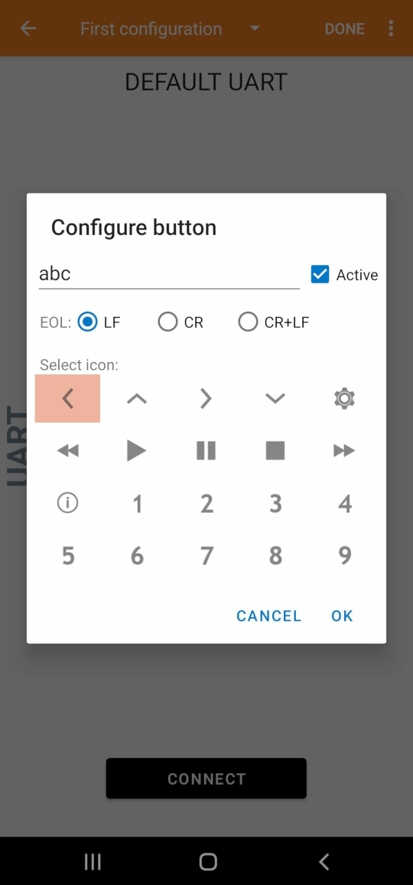

- กดปุ่ม DONE

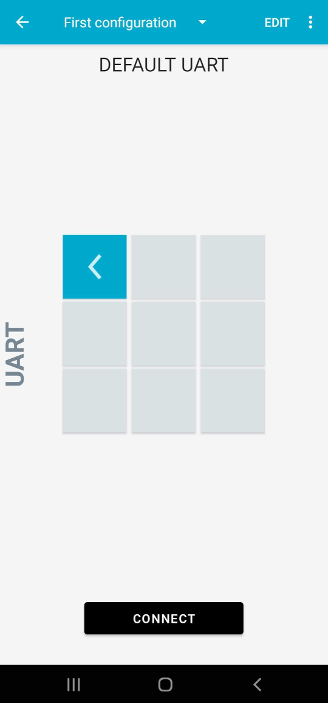

### ตัวอย่างโปรแกรมแบบที่ 1
- แสดงข้อมูลที่รับเข้ามาเป็นตัวอักษรวิ่งบนจอภาพ
- ส่งข้อมูลตัวอักษร "Hello World!" ออกไปทุกๆ 5 วินาที

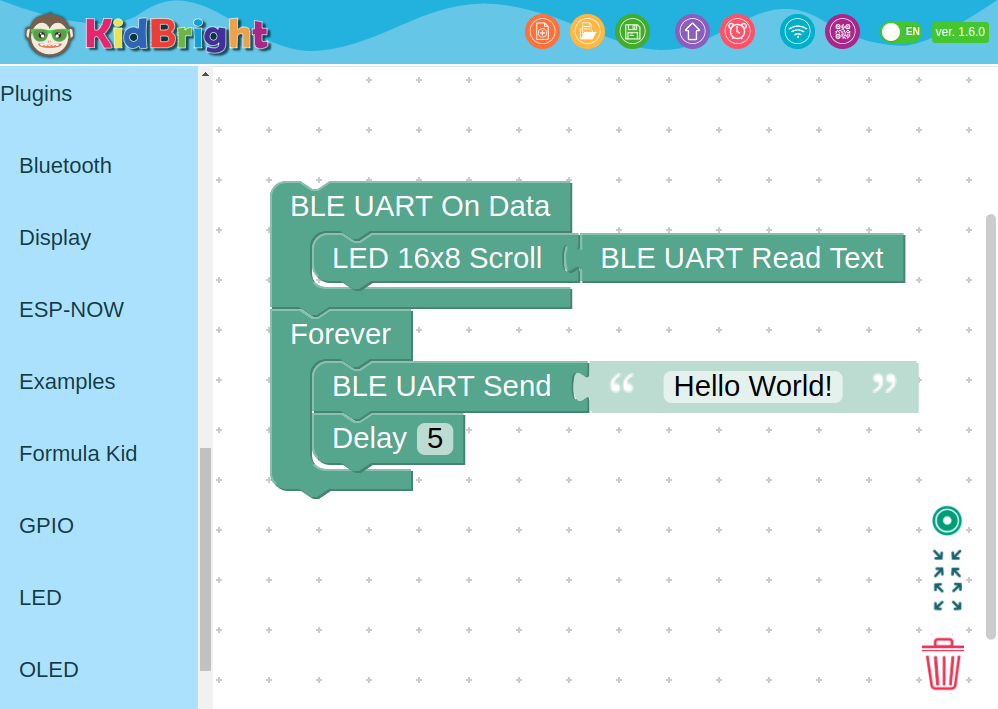

- การเชื่อมต่อ nRF Toolbox กับบอร์ด KidBright ให้กดปุ่ม Connect แล้วเลือกชื่อบอร์ด KidBright แสดงด้วยตัวอักษร BLEUART แล้วตามด้วยเลขฐานสิบหกของ MAC Address ของบอร์ด 3 ไบท์สุดท้ายบวกด้วย 2

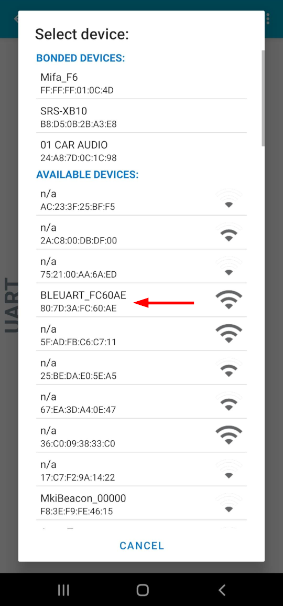

- เปิดหน้าแสดงการรับข้อมูลของ nRF Toolbox โดยสไลด์หน้าจอไปทางขวา

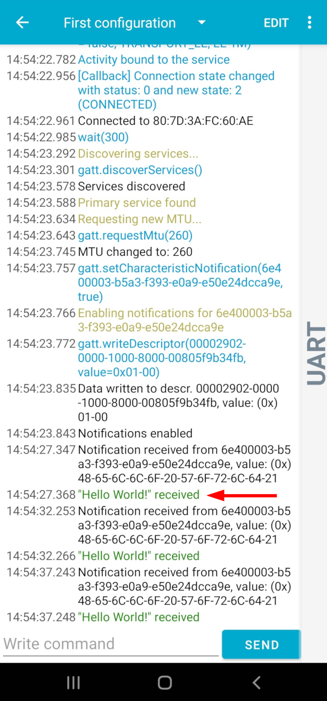

- กดปุ่มที่สร้างให้ส่งข้อความใน nRF Toolbox เพื่อส่งข้อความไปแสดงบนหน้าจอบอร์ด KidBright

### ตัวอย่างโปรแกรมแบบที่ 2
- แสดงข้อมูลที่รับเข้ามาเป็นตัวอักษรวิ่งบนจอภาพ
- ส่งข้อมูลเซ็นเซอร์วัดอุณหภูมิบนบอร์ด KidBright ออกไปทุกๆ 5 วินาที

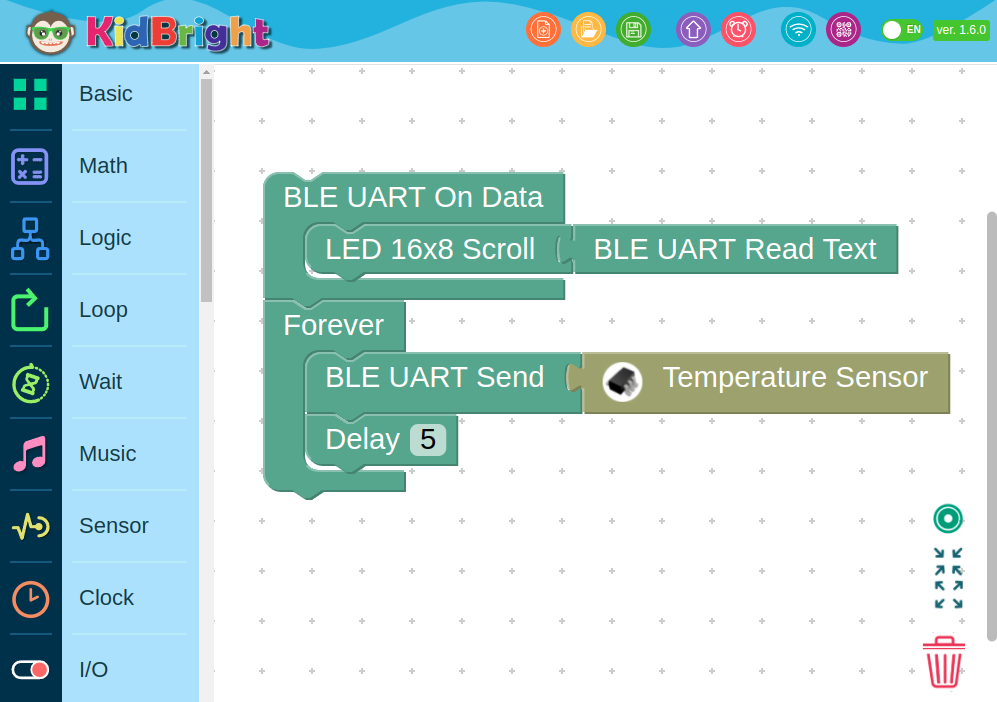

- เปิดหน้าแสดงการรับข้อมูลของ nRF Toolbox โดยสไลด์หน้าจอไปทางขวา

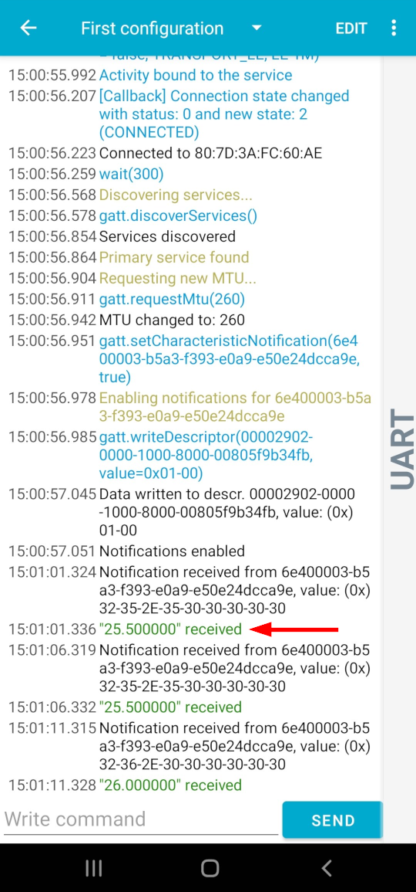

- กดปุ่มที่สร้างให้ส่งข้อความใน nRF Toolbox เพื่อส่งข้อความไปแสดงบนหน้าจอบอร์ด KidBright
