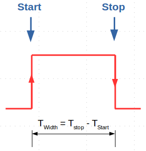
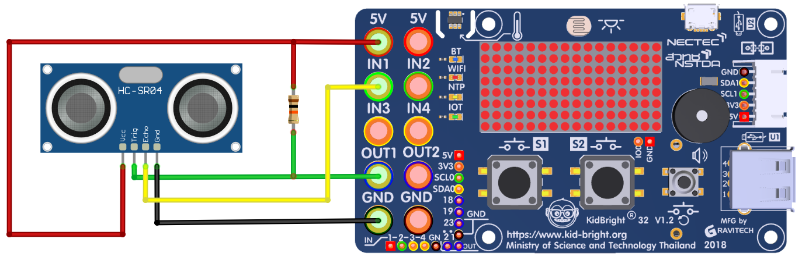

# Pulse Capture plugin

### Pulse Capture
- เป็นการดักจับสัญญาณดิจิตัลที่มีการเปลี่ยนแปลงลอจิกจาก Low ไปเป็น High ขอบขาขึ้น (Rising Edge) หรือกลับกัน ขอบขาลง (Falling Edge) จากช่องสัญญาณอินพุตที่กำหนด 2 ช่อง ประกอบด้วย ช่องอินพุตดักจับสัญญาณเริ่มต้น (Start) และช่องอินพุตดักจับสัญญาณสิ้นสุด (Stop)
- สามารถตั้งให้ช่องดักจับสัญญาณ Start และ Stop เป็นช่องอินพุตเดียวกันได้
- หลังจากดักจับสัญญาณเริ่มต้นและสิ้นสุดได้แล้ว จะทำการคำนวณระยะเวลาระหว่างสัญญาณทั้งสองนั้น (Width)

ตัวอย่างการดักจับสัญญาณเริ่มต้นเป็นขอบขาขึ้น (Rising Edge) และดักจับสัญญาณสิ้นสุดเป็นขอบขาลง (Falling Edge) เพิื่อหาความกว้าง Pulse ของสัญญาณที่เข้ามาทางขาอินพุตหนึ่ง

### Pulse Capture plugin
- สามารถเลือกดักจับสัญญาณที่เข้ามาทางช่องอินพุต IN1, IN2, IN3 และ IN4
- กำหนดชนิดของขอบขาสัญญาณอินพุตแต่ละช่องเป็น ขอบขาขึ้น (Rising Edge) หรือ ขอบขาลง (Falling Edge) ได้
- ความละเอียดของการคำนวณระยะเวลาระหว่างสัญญาณเริ่มต้นและสุดสุด 1 ไมโครวินาที
- สามารถตั้งค่าเวลาที่จะรอจนดักจับสัญญาณได้ครบ ความละเอียด 1 มิลลิวินาที
- ถ้าหมดเวลาที่ตั้งเพื่อรอสัญญาณที่ดักจับแล้วไม่พบสัญญาณตามที่ตั้งค่าไว้ บล๊อกจะให้ค่าระยะเวลาที่คำนวณได้เป็น "ศูนย์"

### บล๊อก
- หมวด GPIO
- บล๊อก Pulse Capture Read

### ตัวเลือกในบล๊อก
- Start ช่องอินพุตของสัญญาณที่จะดักจับเริ่มต้น เลือกเป็น IN1, IN2, IN3 หรือ IN4
- ขอบขาสัญญาณของช่องอินพุตเริ่มต้น เลือกเป็น ขอบขาขึ้น หรือ ขอบขาลง
- Stop ช่องอินพุตของสัญญาณที่จะดักจับสิ้นสุด เลือกเป็น IN1, IN2, IN3 หรือ IN4
- ขอบขาสัญญาณของช่องอินพุตสิ้นสุด เลือกเป็น ขอบขาขึ้น หรือ ขอบขาลง
- Timeout ระยะเวลาที่รอจนกว่าจะพบสัญญาณที่ตั้งค่าไว้เพื่อดักจับ ความละเอียด 1 มิลลิวินาที

### ตัวอย่างการประยุกต์ใช้งานกับเซนเซอร์วัดระยะทางด้วยคลื่น Ultrasonic (HC-SR04)
- ต่อโมดูลเซ็นเซอร์วัดระยะ HC-SR04 เข้ากับบอร์ด KidBright32 ตามรูปด้านล่าง
- ช่อง OUT1 ต่อตัวต้านทาน 10K เข้าไฟเลี้ยง 5V แล้วต่อไปยังขา Trig ของ HC-SR04
- ข่อง IN1 ต่อไปยังขา Echo ของ HC-SR04
- จ่ายไฟ 5V ไปยังขา VCC ของ HC-SR04
- จ่ายไฟ GND ไปยังขา GND ของ HC-SR04

### ตัวอย่างโปรแกรม
- สร้าง Pulse ขนาด 10 us ส่งออกทางเอาท์พุต OUT1
- ดักจับสัญญาณเริ่มต้นช่องอินพุต IN1 แบบขอบขาขึ้น และดักจับสัญญาณสิ้นสุดช่องอินพุต IN1 แบบขอบขาลง รอไม่เกิน 1000 มิลลิวินาที (1 วินาที) เก็บไว้ในตัวแปร interval
- คำนวณระยะเป็นเซนติเมตร (ค่าเวลาที่วัดได้เป็นไมโครวินาที หารด้วย 58) แล้วแสดงผลเป็นตัวอักษรวิ่ง
- รอจนกว่าตัวอักษรวิ่งจนหมด แล้วเริ่มทำซ้ำ

### สัญญาณที่บันทึกด้วย Oscilloscope
- ช่อง 1 (สีเหลือง) เป็น Pulse ขนาด 10 us ส่งไปยังขา Trig ของโมดูล HC-SR04
- ช่อง 2 (สีฟ้า) เป็นสัญญาณที่ส่งกลับมาจากโมดูล HC-SR04 เพื่อคำนวณระยะ

