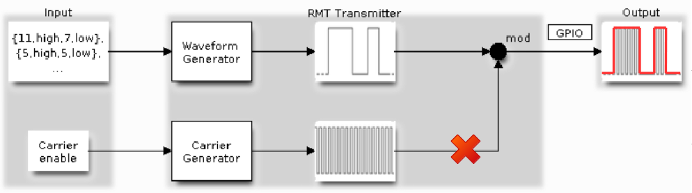
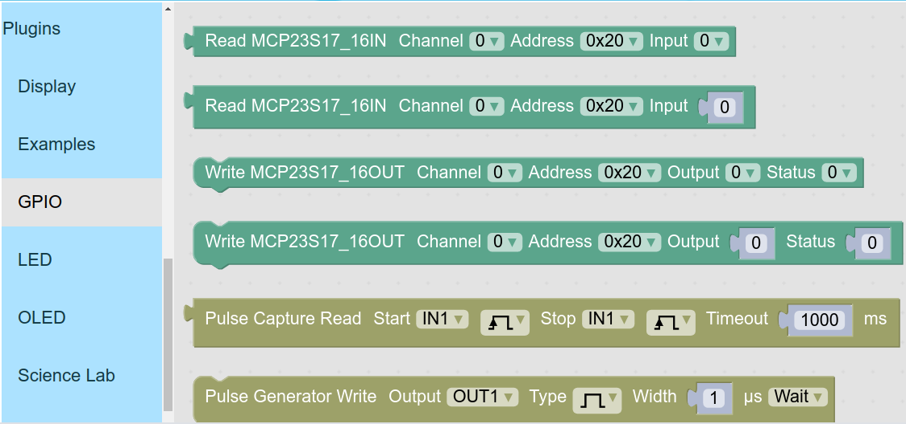
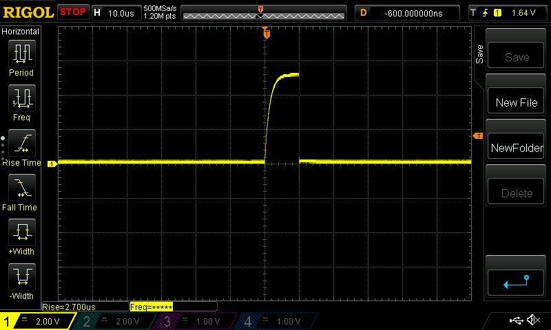

# Pulse Generator plugin

### Pulse Generator
- เป็นการสร้างสัญญาณดิจิตัลที่มีการเปลี่ยนแปลงลอจิกจาก Low ไปเป็น High (Acitve High) หรือกลับกัน (Active Low) แบบกำหนดช่วงเวลาช่วงที่ Active ได้
- ใช้งานโมดูล Remote Control (RMT) โดยปิดส่วนสร้างสัญญาณพาหะ (Carrier Generator)
- ช่องเอาต์พุต OUT1 ใช้งาน RMT ช่อง 2 (RMT_CHANNEL_2)
- ช่องเอาต์พุต OUT2 ใช้งาน RMT ช่อง 3 (RMT_CHANNEL_3)

### Pulse Generator plugin
- สามารถเลือกสร้าง Pulse ออกทางช่องเอาต์พุต OUT1 และ OUT2
- กำหนดชนิดของ Pulse ได้ทั้งแบบ Active High หรือ Low
- กำหนดความกว้าง Pulse ได้ ความละเอียด 1 ไมโครวินาที
- กำหนดให้รอ Pulse สร้างเสร็จก่อนหรือไม่ก็ได้
- เนื่องจาก OUT1 และ OUT2 เป็นเอาต์พุตชนิด Open-Drain ถ้าต้องการให้สามารถขับสัญญาณช่วง High ได้ ให้เลือกต่อ ตัวต้านทาน 10K ขึ้นแรงดันตามที่ต้องการ (Pull-Up)

### บล๊อก
- หมวด GPIO
- บล๊อก Pulse Generator Write

### ตัวเลือกในบล๊อก
- Output ช่องเอาต์พุตที่ต้องการให้สัญญาณออก เลือกเป็น OUT1 หรือ OUT2
- Type กำหนดชนิดของ Pulse เลือกเป็น Active High หรือ Low
- Width กำหนดความกว้างของ Pulse ความละเอียด 1 ไมโครวินาที
- Wait/No Wait เลือกให้บล๊อกรอจนกว่า Pulse จะสร้างจนเสร็จ หรือไม่รอให้สร้างเสร็จ

### ตัวอย่างโปรแกรม สร้าง Pulse แบบ Active High ความกว้าง 10 ไมโครวินาที ออกทางช่องเอาต์พุต OUT1

### สัญญาณที่บันทึกด้วย Oscilloscope

