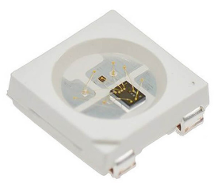
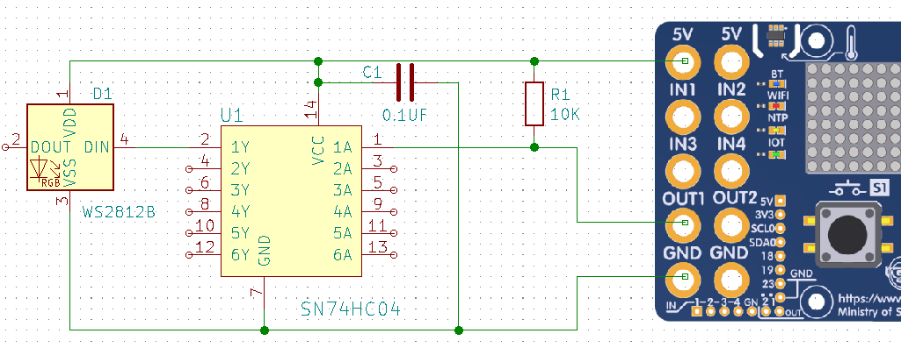
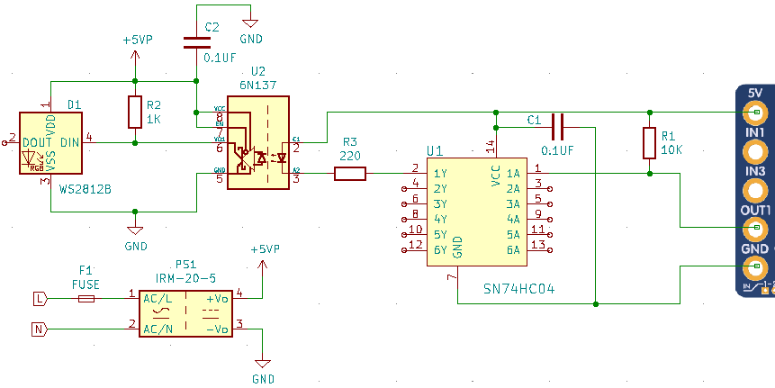
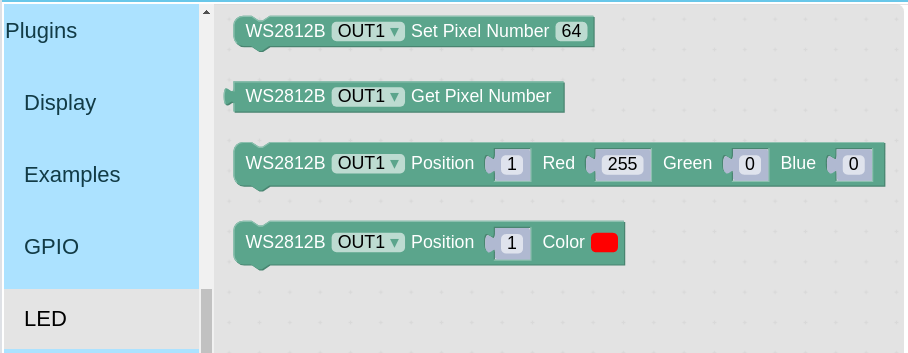
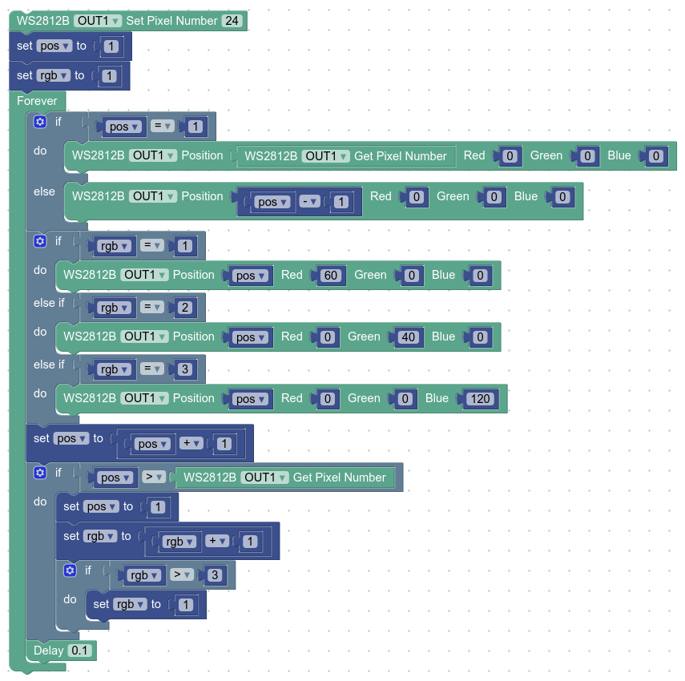

# WS2812B RGB LED plugin

### หลอดไฟแอลอีดีแบบ RGB เบอร์ WS2812B
- ใช้งานแรงดัน 5 โวลต์ กระแสประมาณ 50 ถึง 60 มิลลิแอมป์ ต่อดวง
- ต่อพ่วงเพื่อเพิ่มจำนวนให้มากขึ้นได้ กรณีต่อจำนวนมากต้องแยกแหล่งจ่ายไฟออกจากบอร์ด KidBright32

### WS2812B plugin
- ต่อ WS2812B ผ่านช่อง OUT1 หรือ OUT2
- รองรับ WS2812B ได้สูงสุด 64 ดวง ต่อช่อง OUT1 หรือ OUT2
- ซอฟ์ทแวร์ใช้ Double Buffering Video Ram และ DMA ผ่าน ESP32 RMT (Remote Control)
- วงจรต่อใช้งาน ประกอบด้วยไอซี 74HC04, ตัวต้านทาน 10K และตัวเก็บประจุ 0.1uF ดังนี้

- วงจรต่อใช้งานแบบแยกแรงดัน WS2812B ออกจากบอร์ด KidBright32 เพิ่มตัวต้านทาน 220, 1K, ตัวเก็บประจุ 0.1uF, ไอซี 6N137 และชุดจ่ายไฟแรงดัน 5V ขนาดกระแสตามจำนวน WS2812B ที่ต่อพ่วงกัน

*** ข้อควรระวัง: เนื่องจากวงจรมีส่วนแรงดันไฟสูง 220 โวลต์ ควรใช้ความระมัดระวังเป็นอย่างสูงในการต่อใช้งาน ไม่แนะนำสำหรับเด็ก และผู้ที่ยังไม่มีประสบการณ์ในการต่อวงจรแรงดันสูง

### บล๊อก
- หมวด LED
- บล๊อก WS2812B Set Pixel Number สำหรับตั้งค่าจำนวนดวงของ WS2812B ที่ใช้งาน
- บล๊อก WS2812B Get Pixel Number สำหรับอ่านค่าจำนวนดวงของ WS2812B ที่ตั้งค่าไว้
- บล๊อก WS2812B สำหรับแสดงสีแดง, เขียว, น้ำเงิน ของ WS2812B ตามตำแหน่งดวงที่กำหนดไว้
- บล๊อก WS2812B สำหรับแสดงสีแดง, เขียว, น้ำเงิน แบบเลือกจากตารางสี ของ WS2812B ตามตำแหน่งดวงที่กำหนดไว้

### ตัวเลือกในบล๊อก
- ช่องที่ต่อ WS2812B อยู่ เลือกเป็น OUT1 หรือ OUT2
- Position กำหนดให้มีผลกับตำแหน่งของ WS2812B ที่ต่อพ่วงไว้ มีค่าตั้งแต่ 1 ถึง 64
- Red, Green, Blue กำหนดค่าสีตั้งแต่ 0 ถึง 255
- Color เลือกค่าสีจากตารางสี

### ตัวอย่างโปรแกรม สำหรับ WS2812B แบบวงแหวนจำนวน 24 ดวง

