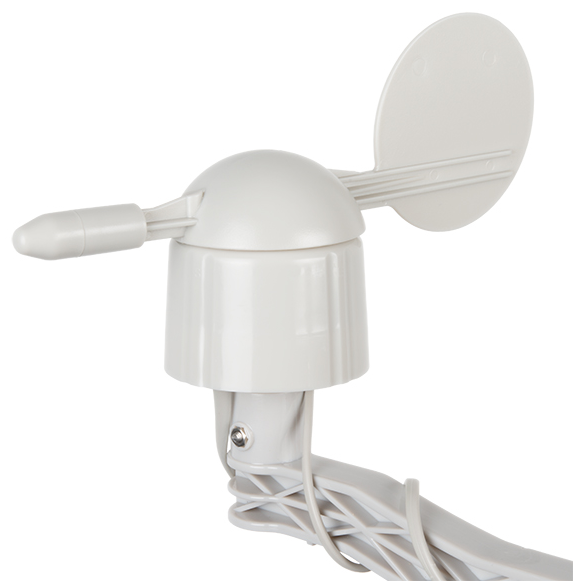
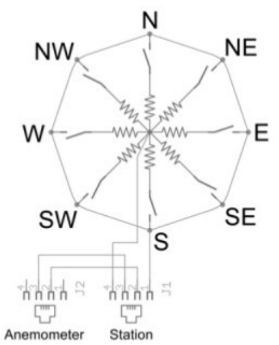
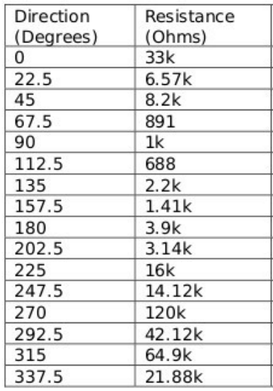
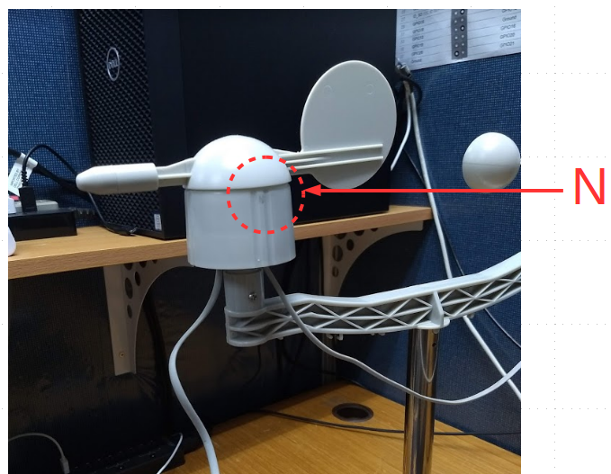
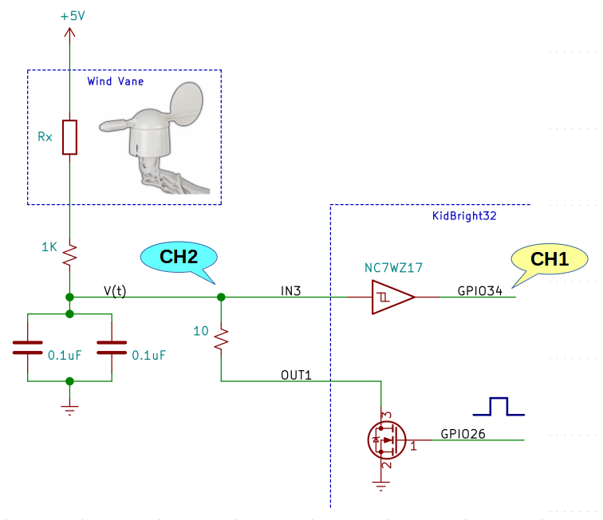
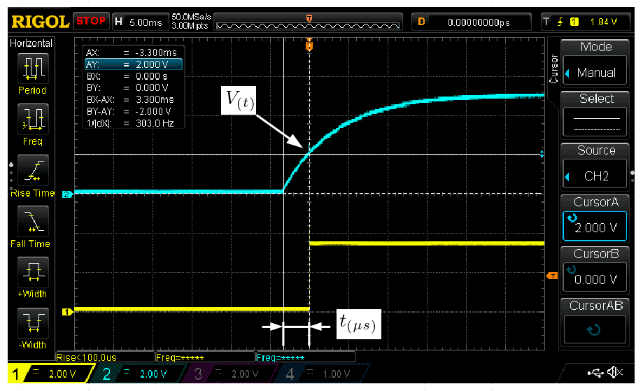
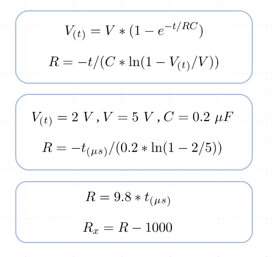
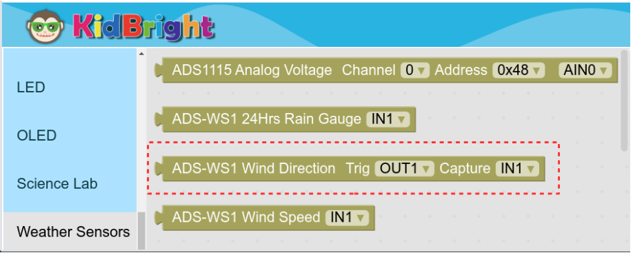
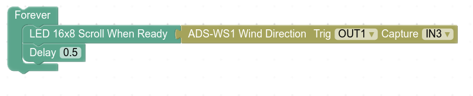

# Wind Direction plugin

### เซ็นเซอร์วัดทิศทางลม (Wind Vane) สำหรับสถานีวัดอากาศรุ่น ADS-WS1

- ใช้การหมุนของตัววัดเพื่อไปต่อหน้าคอนแทคเลือกค่าตัวต้านทาน ซึ่งจะสัมพันธ์กับมุมของตัววัด
- ใช้หัวต่อ RJ-11 (J1) แบบ 4 ขา โดยพ่วงค่าสัญญาณจากหัวต่อเซ็นเซอร์วัดความเร็วลม (J2) 2 ขา และจากตัวเซ็นเซอร์วัดทิศทางลมเองอีก 2 ขา

- วัดทิศทางลมได้ 16 ตำแหน่ง โดยทิศเหนือจะให้ค่ามุมเป็น 0 องศา, ทิศตะวันออกเฉียงเหนือเป็น 45 องศา, ระหว่างทิศเหนือกับตะวันออกเฉียงเหนือเป็น 22.5 องศา ทิศตะวันออกเป็น 90 องศา เป็นต้น ตามตารางความสัมพันธ์ของทิศกับค่าความต้านทานดังต่อไปนี้

- การติดตั้งให้หันตำแหน่งตัวอักษร N ไปยังทิศเหนือ

### อุปกรณ์สำหรับต่อใช้งาน
- เซ็นเซอร์วัดทิศทางลมสำหรับสถานีวัดอากาศรุ่น ADS-WS1
- ตัวต้านทานขนาด 1/8 วัตต์ ค่า 1 กิโลโอห์ม จำนวน 1 ตัว
- ตัวต้านทานขนาด 1/8 วัตต์ ค่า 10 โอห์ม จำนวน 1 ตัว
- ตัวเก็บประจุชนิดเซรามิคค่า 0.1 uF จำนวน 2 ตัว
- สายไฟ

### การต่อวงจรเซ็นเซอร์วัดทิศทางลมเข้ากับบอร์ด KidBright

### หลักการวัดค่าความต้านทานด้วยบอร์ด KidBright (RC Impulse Response)
- ใช้ขา OUT1 เพื่อคายประจุของตัวเก็บประจุค่า 0.2 uF (0.1 uF จำนวน 2 ตัวต่อขนานกัน) ออกจนหมด ผ่านทางตัวต้านทาน 10 โอห์ม
- ยกเลิกการคายประจุและเริ่มจับเวลา ปล่อยให้แรงดัน 5 โวลต์ ชาร์ทตัวเก็บประจุผ่านตัวต้านทานภายในของเซ็นเซอร์วัดทิศทางลม และตัวต้านทานขนาด 1 กิโลโอห์ม
- เมื่อแรงดันในตัวเก็บประจุ V(t) เพิ่มขึ้นจนถึงค่าที่ทำให้สัญญาณขาออก Schmitt Trigger NC7WZ17 เปลี่ยนจากโลจิก 0 ไปเป็น 1 หยุดจับเวลา และบันทึกค่าเวลาที่วัดได้ t(uS) นำไปคำนวณค่าความต้านทาน Rx

### รูปสัญญาณ RC Impulse Response จากออสซิลโลสโคป

- รูปสัญญาณสีฟ้า (CH2) แสดงแรงดันขณะตัวเก็บประจุถูกชาร์ท
- รูปสัญญาณสีเหลือง (CH1) เป็นแรงดันขาออกของ Schmitt Trigger NC7WZ17
- V(t) เป็นตำแหน่งแรงดันที่ตัวเก็บประจุ ที่ทำให้สัญญาณขาออกของ Schmitt Trigger NC7WZ17 เปลี่ยนจากโลจิก 0 เป็น 1 ในรูปออสซิลโลสโคปวัดได้ค่า 2 โวลต์
- t(us) เป็นค่าเวลาที่ีวัดได้หน่วยเป็นไมโครวินาที เพื่อนำไปคำนวณหาค่าความต้านทานภายในของเซ็นเซอร์วัดทิศทางลม Rx

### สูตรการคำนวณค่าความต้านทานจาก RC Impulse Response

### การเขียนโปรแกรม
- บล๊อกเซ็นเซอร์วัดทิศทางลมจะอยู่ในหมวด Plugins => Weather Sensors
- ชื่อบล๊อก ADS-WS1 Wind Direction
- เลือกช่องต่อเซ็นเซอร์ให้ตรงตามที่ใช้งาน ค่าสัญญาณ Trig (OUT1 หรือ OUT2) และ Capture (IN1, IN2, IN3 หรือ IN4)

### ตัวอย่างโปรแกรมแสดงทิศทางลมเป็นตัวอักษรวิ่ง

