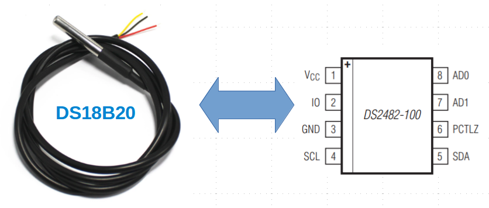
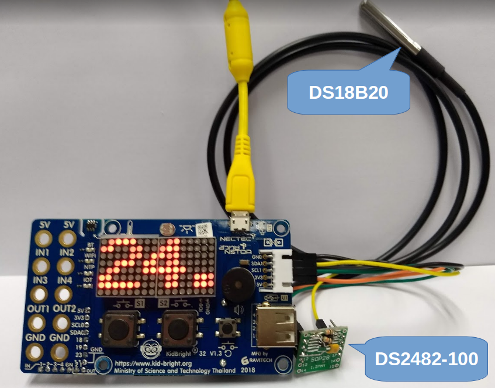
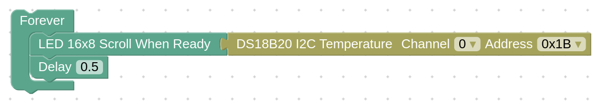
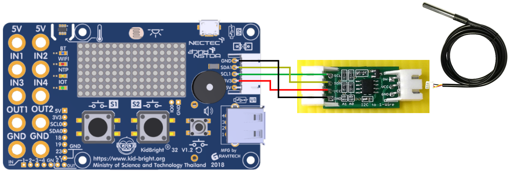

# DS18B20 I2C plugin

### เซ็นเซอร์วัดอุณหภูมิแบบ 1-Wire เบอร์ DS18B20
- วัดอุณหภูมิในช่วง -55°C ถึง +125°C เชื่อมต่อแบบ 1-Wire
- ต่อเซ็นเซอร์ DS18B20 เข้าชิพ DS2482-100 แปลงการเชื่อมต่อเป็น I2C
- DS2482-100 ต่อได้สูงสุด 4 ตัว ต่อ I2C 1 แชนแนล

### การต่อใช้งานจาก KidBright I2C Chain ไปยัง DS2482-100
- กราวด์ (GND) (สายไฟสีดำ) ต่อไปยังขา GND
- SDA1 (สายไฟสีเหลือง) ต่อไปยังขา SDA
- SCL1 (สายไฟสีเขียว) ต่อไปยังขา SCL
- แรงดัน 3.3 โวลต์ (3V3) (สายไฟสีส้ม) ต่อไปยังขา VCC

### บล๊อก
- หมวด Science Lab
- บล๊อก DS18B20 I2C Temperature สำหรับอ่านค่าเซ็นเซอร์ DS18B20

### ตัวเลือกในบล๊อก
- ช่องที่ต่อ I2C ของชิพ DS2482-100 ปกติเป็นช่อง 0
- แอดเดรส I2C ของชิพ DS2482-100 ปกติเป็น 0x18

### ตัวอย่างโปรแกรม

### ตัวอย่างการต่อบอร์ด KidBright กับบอร์ดแปลง I2C เป็น 1-WIRE

