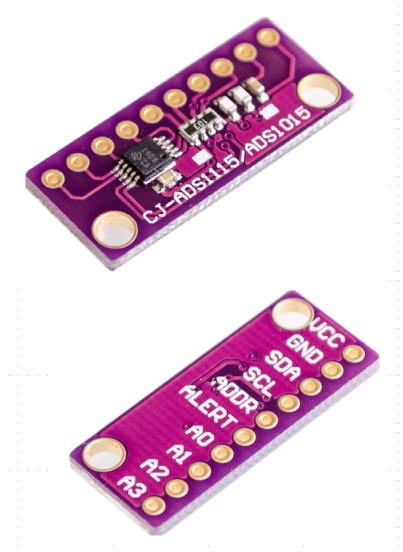
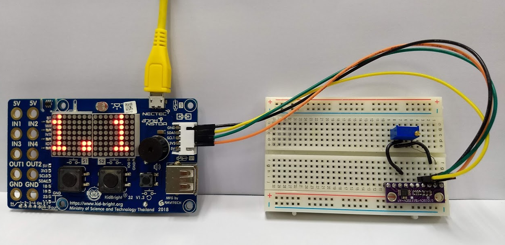
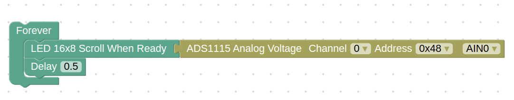

# ADS1115 Analog to Digital (ADC) plugin

### เซ็นเซอร์แปลงแรงดันไฟฟ้าแอนะล็อกเป็นค่าดิจิตัลเบอร์ ADS1115
- อินพุต 4 ช่อง (AIN0,AIN1,AIN2,AIN3)
- ADC ขนาด 16 บิท
- การเชื่อมต่อแบบ I2C
- ต่อได้สูงสุด 4 ตัว ต่อ I2C 1 แชนแนล
- ตั้งค่าแรงดันอินพุตเป็นแบบ Single-Ended (แรงดันอินพุตเทียบกับกราวด์)
- ตั้งค่าอ่านแรงดันอินพุตสูงสุดไม่เกิน 2.048 โวลต์

### การต่อใช้งานจาก KidBright I2C Chain ไปยัง ADS1115
- กราวด์ (GND) (สายไฟสีดำ) ต่อไปยังขา GND
- SDA1 (สายไฟสีเหลือง) ต่อไปยังขา SDA
- SCL1 (สายไฟสีเขียว) ต่อไปยังขา SCL
- แรงดัน 3.3 โวลต์ (3V3) (สายไฟสีส้ม) ต่อไปยังขา VCC

### บล๊อก
- หมวด Weather Sensors
- บล๊อก ADS1115 Analog Voltage สำหรับอ่านค่าแรงดันไฟฟ้าแอนะล๊อก

### ตัวเลือกในบล๊อก
- ช่องที่ต่อ I2C ของชิพ ADS1115 ปกติเป็นช่อง 0
- แอดเดรส I2C ของชิพ ADS1115 ปกติเป็น 0x48

### ตัวอย่างโปรแกรม

