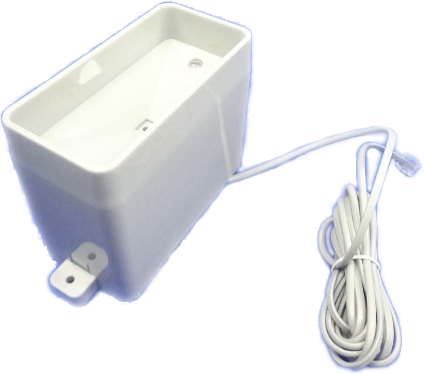
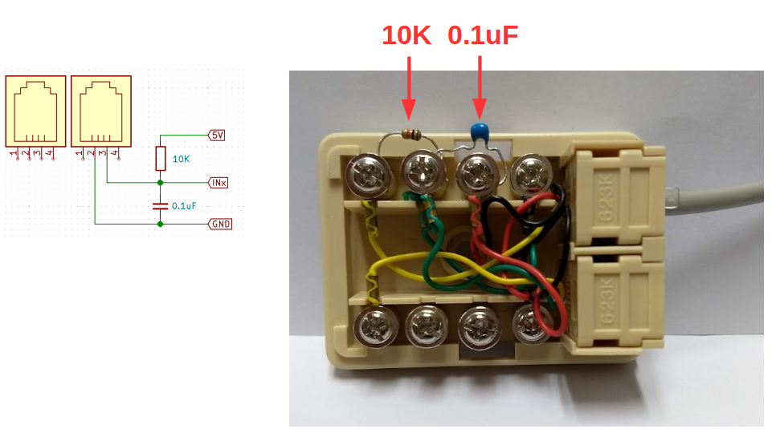
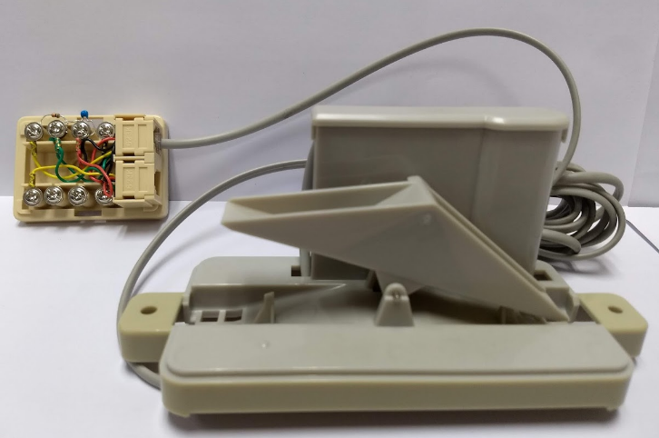
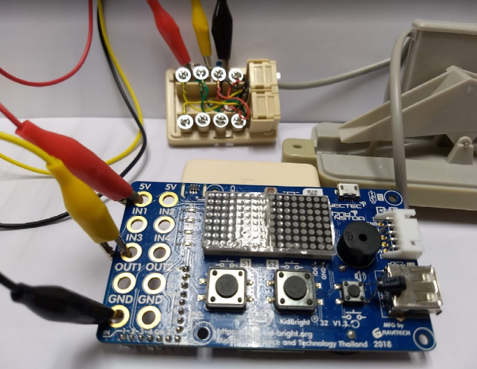
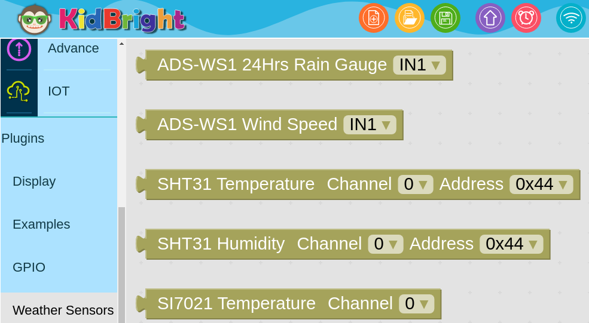

# Rain Gauge plugin

### เซ็นเซอร์วัดปริมาณน้ำฝนสำหรับสถานีวัดอากาศรุ่น ADS-WS1

- วัดปริมาณน้ำฝน 0.2794 mm. ต่อการขยับของคานกระดก 1 ครั้ง
- การเชื่อมต่อแบบหน้าคอนแทคเอาท์พุต

### อุปกรณ์สำหรับต่อใช้งาน
- เซ็นเซอร์วัดปริมาณน้ำฝนสำหรับสถานีวัดอากาศรุ่น ADS-WS1
- กล่องต่อพ่วงสายโทรศัพท์แบบ 2 ช่อง
- ตัวต้านทานขนาด 1/8 วัตต์ ค่า 10K
- ตัวเก็บประจุชนิดเซรามิคค่า 0.1 uF
- สายไฟ

### ต่อตัวต้านทานและตัวเก็บประจุเข้ากับกล่องต่อพ่วงสายโทรศัพท์

### เสียบสายเซ็นเซอร์วัดปริมาณน้ำฝนเข้ากับกล่องต่อพ่วงสายโทรศัพท์

### ต่อสายไฟ 5V, GND และสายสัญญาณเข้าช่อง IN ที่ต้องการใช้งาน

### การเขียนโปรแกรม
- บล๊อกเซ็นเซอร์วัดปริมาณน้ำฝนจะอยู่ในหมวด Plugins => Weather Sensors
- ชื่อบล๊อก ADS-WS1 24Hrs Rain Gauge
- เลือกช่องต่อเซ็นเซอร์ให้ตรงตามที่ใช้งาน (IN1, IN2, IN3 หรือ IN4)
- ค่าปริมาณน้ำฝนที่อ่านได้จะเป็นค่าสะสมย้อนหลัง 24 ชั่วโมง และจะรีเซ็ตค่ากลับเป็นศูนย์เมื่อขึ้นวันใหม่
- ต้องตั้งนาฬิกาของบอร์ด KidBright ให้ตรงก่อนการใช้งานด้วยทุกครั้ง

