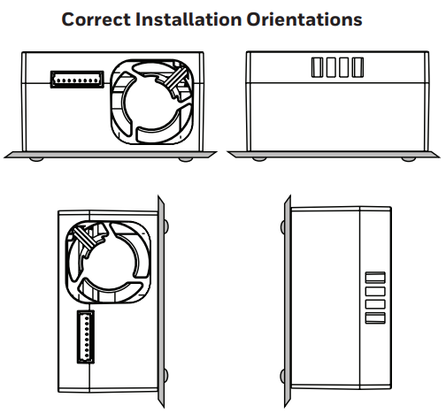

# HPMA115S0 Particulate Matter Sensors (PM2.5/PM10) plugin

### เซ็นเซอร์วัดฝุ่นละออง (Particulate Matter) รุ่น HPMA115S0

- ใช้แสงเลเซอร์เพื่อวัดอนุภาคฝุ่นละออง
- ช่วงการวัดอยู่ที่ 0 ถึง 1,000 ไมโครกรัมต่อลูกบาศก์เมตร
- สามารถวัดฝุ่นละออง PM2.5 และ PM10 ได้

### หลักการทำงานของเซ็นเซอร์ HPMA115S0


1) ช่องทางเข้าของอากาศที่ถูกพัดลมติดตั้งภายในดูดเข้ามา (air inlet)
2) อากาศเคลื่อนที่ผ่านแสงเลเซอร์สะท้อนอนุภาคฝุ่นไปยังโฟรโตไดโอด (photodiode)
3) ข้อมูลโฟรโตไดโอดส่งต่อไปยังตัวแปลงสัญญาณแสงเป็นไฟฟ้า (photoelectric)
4) สัญญาณไฟฟ้าถูกประมวลผลที่หน่วยประมวลผลขนาดเล็ก (micro control unit)

### ตำแหน่งการวางเซ็นเซอร์ที่แนะนำตามคู่มือการใช้งานของผู้ผลิต



### วงจรการต่อเซ็นเซอร์ HPMA115S0 เข้ากับบอร์ด KidBright32 สำหรับสถานีวัดอากาศอุตุฯน้อย


### การเขียนโปรแกรม
- บล๊อกเซ็นเซอร์วัดฝุ่นละออง HPMA115S0 อยู่ในหมวด Plugins => Weather Sensors
- ชื่อบล๊อก
	- HPMA115S0 PM2.5 => บล๊อกอ่านค่า PM2.5
	- HPMA115S0 PM10 => บล๊อกอ่านค่า PM10
	- Check HPMA115S0 Error => บล๊อกตรวจสอบสถานะเซ็นเซอร์
- ตั้งค่าการต่อเซ็นเซอร์ให้ตรงตามที่ต่อใช้งานอยู่ สำหรับสถานีวัดอากาศอุตุฯน้อย ให้เลือก TX เป็น OUT2 และ RX เป็น IN4


### ตัวอย่างโปรแกรมแสดงค่าฝุ่นละออง PM2.5 บนจอแอลอีดี 16x8 ถ้าพบความผิดพลาดของเซ็นเซอร์จะแสดงเป็นสัญลักษณ์ "--"


### หน้าเว็บรายละเอียดเซ็นเซอร์ HPMA115S0 ของบริษัทผู้ผลิต
```
https://sps.honeywell.com/us/en/products/sensing-and-iot/sensors/particulate-matter-sensors/hpm-series
```

### คู่มือเซ็นเซอร์ HPMA115S0 (datasheet)
```
https://prod-edam.honeywell.com/content/dam/honeywell-edam/sps/siot/en-us/products/sensors/particulate-matter-sensors-hpm-series/documents/sps-siot-particulate-hpm-series-datasheet-32322550-ciid-165855.pdf
```
